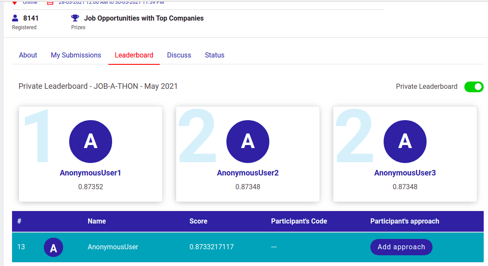

## Problem statement

Happy Customer Bank is a mid-sized private bank that deals in all kinds of banking products, like Savings accounts, Current accounts, investment products, credit products, among other offerings.

The bank also cross-sells products to its existing customers and to do so they use different kinds of communication like tele-calling, e-mails, recommendations on net banking, mobile banking, etc.

In this case, the Happy Customer Bank wants to cross sell its credit cards to its existing customers. The bank has identified a set of customers that are eligible for taking these credit cards.

Now, the bank is looking for your help in identifying customers that could show higher intent towards a recommended credit card, given:

Customer details (gender, age, region etc.)
Details of his/her relationship with the bank (ChannelCode,Vintage, 'AvgAsset_Value etc.)

## Description of my Method

### Feature Engineering

1. Null values in Credit_Product feature was filled with 'no_cp'. As these ID were not having credit product.
2. Plotted probability density in seaborn for numerical features i.e, Age, Vinatge, Avg_Account_Balance.
	(a) Avg_Account_Balance feature was highly skewed.
	(b) Boxplot: Avg_Account_Balance vs target categorical variable gave information that Avg_Account_Balance 
	    does not have much affect on target variable.
	(c) Tried encoding into bins, transformation of Avg_Account_Balance but removing this feature helped.
3. All other categorical features were encoded.
4. Gender feature was removed based on experiments which also helped.
5. Tried adding many new combination of features, but result was not improved.

### Model

1. Tried Random Forest, LightGBM and CatBoost.
2. Catboost gave best result on validation set.
3. Class weight was also tried seeing nearly 3:1 of data, but result was not improved.

# Ranking on Private Leader Board

